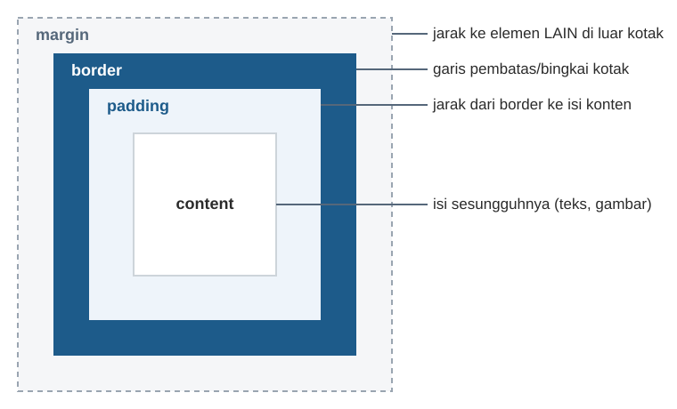

# 1. Konsep Dasar CSS

Sebelum membedah `style.css`, kenali dulu istilah-istilah CSS yang akan
terus muncul di seluruh dokumentasi ini.

## 1.1 Apa itu CSS?

**CSS (Cascading Style Sheets)** adalah bahasa untuk mengatur **tampilan**
elemen HTML — warna, ukuran, jarak, tata letak, dan sebagainya. Kalau HTML
menentukan **struktur/isi** halaman (judul, paragraf, tabel, form), CSS
menentukan **bagaimana rupanya** di layar.

## 1.2 Anatomi Satu Aturan CSS (CSS Rule)

```css
header {
    background-color: #1d5b8a;
    color: #fff;
}
```

| Bagian | Contoh | Fungsi |
|---|---|---|
| **Selector** | `header` | Menentukan **elemen HTML mana** yang diberi gaya ini. Di sini artinya "semua tag `<header>`". |
| **Deklarasi** | `background-color: #1d5b8a;` | Satu aturan gaya, terdiri dari **properti** dan **nilai**, diakhiri titik koma `;`. |
| **Properti** | `background-color` | Aspek tampilan yang diatur (warna latar, ukuran font, dll). |
| **Nilai** | `#1d5b8a` | Nilai yang diberikan ke properti tersebut. |
| **Blok deklarasi** | `{ ... }` | Kurung kurawal yang membungkus satu atau lebih deklarasi untuk selector yang sama. |

## 1.3 Menghubungkan CSS ke HTML

Ada 3 cara menghubungkan CSS ke HTML, tapi jobsheet ini memakai cara yang
**paling direkomendasikan**: file CSS terpisah, dihubungkan lewat tag
`<link>` di dalam `<head>`:

```html
<link rel="stylesheet" href="assets/css/style.css">
```

- `rel="stylesheet"` — memberi tahu browser bahwa file yang di-link ini
  adalah lembar gaya (stylesheet).
- `href="..."` — lokasi file CSS-nya. Sama seperti tautan `<a href="...">`
  di [dokumentasi jobsheet-01](../../jobsheet-01/dokumentasi/01-konsep-dasar.md#15-navigasi-antar-halaman-a-href),
  path ini **relatif** terhadap lokasi file HTML — lihat penjelasan
  lengkapnya di [bab 2](02-perubahan-file-html.md).

Keuntungan memisahkan CSS ke file sendiri (dibanding menulis style
langsung di setiap tag HTML): **satu file `style.css` dipakai bersama
oleh 5 halaman HTML sekaligus** — kalau warna tombol ingin diganti,
cukup ubah satu baris di `style.css`, otomatis berubah di semua halaman.

## 1.4 Jenis-Jenis Selector yang Dipakai di `style.css`

| Jenis Selector | Contoh di `style.css` | Artinya |
|---|---|---|
| **Tag/Elemen** | `body`, `header`, `table` | Pilih semua elemen dengan tag tersebut. |
| **Universal** | `*` | Pilih **semua** elemen tanpa kecuali. |
| **Turunan (descendant)** | `header nav ul`, `td button` | Pilih elemen `ul` yang berada **di dalam** `nav` yang berada di dalam `header`. Urutan kata = urutan bersarang di HTML. |
| **Pseudo-class** | `a:hover`, `tbody tr:hover` | Pilih elemen pada **kondisi/state** tertentu — `:hover` berarti "saat kursor mouse berada di atas elemen ini". |
| **Pseudo-class posisi** | `tbody tr:nth-child(even)`, `main section:nth-of-type(2)` | Pilih elemen berdasarkan **urutan/posisinya** di antara saudara-saudaranya. Dibahas detail di [bab 6](06-css-grid-kartu-statistik.md) dan [bab 7](07-css-tabel.md). |
| **Atribut** | `form button[type="submit"]` | Pilih elemen `button` yang **atributnya** `type` bernilai `"submit"`. |

## 1.5 Kotak Setiap Elemen HTML: Box Model

Setiap elemen HTML di browser sebenarnya adalah sebuah **kotak (box)**,
tersusun dari 4 lapisan dari dalam ke luar:



- **`margin`** — jarak kosong **di luar** kotak, ke elemen tetangga.
- **`border`** — garis di tepi kotak.
- **`padding`** — jarak kosong **di dalam** kotak, antara border dan isi.
- **`content`** — konten sebenarnya (teks, gambar, dll).

Properti `box-sizing: border-box;` (dipakai di baris pertama
`style.css`, lihat [bab 3](03-css-reset-dan-body.md)) mengubah cara
lebar/tinggi elemen dihitung. Ini konsep penting yang dijelaskan detail
di bab berikutnya.

## 1.6 Satuan Ukuran yang Dipakai

Di `style.css` kamu akan menemukan beberapa satuan ukuran berbeda:

| Satuan | Contoh | Artinya |
|---|---|---|
| `px` (pixel) | `border-radius: 8px;` | Ukuran **tetap/absolut**, tidak berubah mengikuti apa pun. |
| `rem` | `padding: 1rem 1.5rem;` | Ukuran **relatif** terhadap ukuran font akar (`<html>`), biasanya `1rem` = 16px secara default. Lebih fleksibel karena ikut menyesuaikan jika pengguna mengubah ukuran font browser. |
| `%` | `width: 100%;` | Ukuran **relatif** terhadap elemen induknya (misalnya lebar 100% dari lebar kotak pembungkusnya). |
| `fr` (fraction) | `grid-template-columns: repeat(3, 1fr);` | Satuan khusus CSS Grid: "1 bagian pecahan" dari ruang yang tersedia. Dibahas di [bab 6](06-css-grid-kartu-statistik.md). |

## 1.7 Warna dalam Format Hex

Warna di `style.css` banyak ditulis dalam format **hex** (heksadesimal),
contoh `#1d5b8a` atau `#fff`:

- Format `#RRGGBB` — dua digit pertama untuk merah (Red), dua berikutnya
  hijau (Green), dua terakhir biru (Blue). Contoh `#1d5b8a` adalah biru
  tua (komponen biru paling dominan).
- `#fff` adalah bentuk singkat dari `#ffffff` (putih penuh) — kalau
  ketiga pasangan digitnya sama, boleh ditulis 3 digit saja.

Dengan bekal istilah-istilah di atas, sekarang kamu siap membaca
penjelasan file `style.css` secara detail mulai bab 3.

Lanjut ke: [Apa yang Berubah di File HTML?](02-perubahan-file-html.md)
